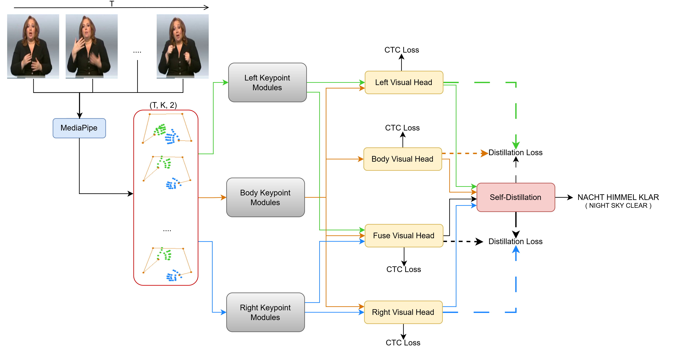
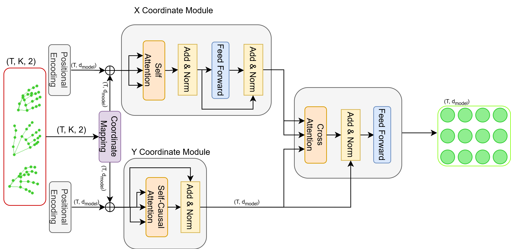

# [Spatial-Coordinate Attention Network for Continuous Sign Language Recognition](https://github.com/tinh2044/SCAttenNet)

<a href="https://pytorch.org/get-started/locally/"></a> [](https://opensource.org/licenses/MIT) [](https://www.python.org/downloads/release/python-380/)

## Abstract
Sign language recognition faces persistent challenges in modeling inter-keypoint correlations and capturing fine-grained articulatory patterns. Existing approaches typically process horizontal and vertical coordinates jointly, obscuring linguistically significant axis-specific motion dynamics. This paper introduces SCAttenNet, a novel multi-stream attention network featuring separate coordinates processing that decomposes skeletal sequences into four region-specific streams. The architecture processes horizontal movements through self-attention mechanisms while modeling vertical dynamics via self-causal attention, with cross-attention fusion explicitly maintaining coordinates interdependencies. A frame-level self-distillation framework further enhances robustness by transferring ensemble knowledge across anatomical streams. Evaluations establish new state-of-the-art performance on standard benchmarks, achieving 18.42\% word error rate on Phoenix-2014 and 17.95\% on Phoenix-2014T - surpassing both keypoint-based and RGB-based methods while eliminating handcrafted graph topologies. The approach presents an efficient solution for continuous sign language recognition with significant potential for enhancing communication accessibility.

<p align="center">
  
</p>

<p align="center">
  
</p>

## Performance

| Dataset | WER | Model | Training |
| :---: | :---: | :---: | :---: | 
| Phoenix-2014 | 18.1% | [ckpt](placeholder) | [config](configs/phoenix-2014_s2g.yaml) |
| Phoenix-2014T | 17.67% | [ckpt](placeholder) | [config](configs/phoenix-2014t_s2g.yaml) |
 

## Installation
```
conda create -n scattennet python==3.8
conda activate scattennet
# Please install PyTorch according to your CUDA version.
pip install -r requirements.txt
```

### Download

**Datasets**

Download datasets from their websites and place them under the corresponding directories in data/
* [Phoenix-2014](https://www-i6.informatik.rwth-aachen.de/~koller/RWTH-PHOENIX/)
* [Phoenix-2014T](https://www-i6.informatik.rwth-aachen.de/~koller/RWTH-PHOENIX-2014-T/)

**Pretrained Models**

We provide pretrained models [Phoenix-2014](placeholder) and [Phoenix-2014T](placeholder). Download this directory and place them under *pretrained_models*.

**Keypoints**
We provide human keypoints for two datasets, [Phoenix-2014](placeholder) and [Phoenix-2014T](placeholder), pre-extracted by MediaPipe/OpenPose. Please download them and place them under *data/Phoenix-2014t(Phoenix-2014)*.

## Training
```
# Train on Phoenix-2014-T dataset
python main.py --cfg_path configs/phoenix-2014t.yaml \
               --batch-size 8 \
               --epochs 100 \
               --device cuda

# Resume training from checkpoint
python main.py --cfg_path configs/phoenix-2014t.yaml \
               --resume outputs/SLR/Phoenix-2014-T/best_checkpoint.pth
```

## Evaluation
```
# Evaluate trained model
python main.py --cfg_path configs/phoenix-2014t.yaml \
               --eval \
               --resume outputs/SLR/Phoenix-2014-T/best_checkpoint.pth
```

<!-- ## Citations
```
@misc{SCAttenNet2024,
title = {SCAttenNet: Spatial-Coordinate Attention Network for Continuous Sign Language Recognition},
author = {Tinh Nguyen},
year = {2024},
url = {https://github.com/tinh2044/SCAttenNet},
}
``` -->

## License

This project is licensed under the MIT License - see the [LICENSE](LICENSE) file for details.

## Acknowledgments

- Phoenix-2014-T dataset providers
- PyTorch team for the deep learning framework
- Sign language research community

---
